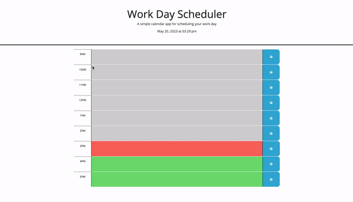

# 05 Third-Party APIs: Work Day Scheduler

## User Story

```md
AS AN employee with a busy schedule
I WANT to add important events to a daily planner
SO THAT I can manage my time effectively
```

## Description

When a user opens this application, they are presented with the current date and time, and time blocks for each hour of the work day (9-5). If the time block's hour is in the past, it will display with a grey background; if the time block's hour is the current hour, it will display with a red background; and finally, if the time block's hour is in the future, it will display with a green background. These colors dynamically update with the current time using dayJS.

Each time block is also allows text input. Users can add tasks to any hour, and upon clicking the save button next to the corresponding block, the task will be saved to local storage and will remain on the page even when refreshed, so that the user can still view all of their saved tasks.

## Application Preview

The following animation demonstrates the application functionality:



### Deployment:

- The application is deployed at: https://kirstynrowen.github.io/workday-scheduler/

---
